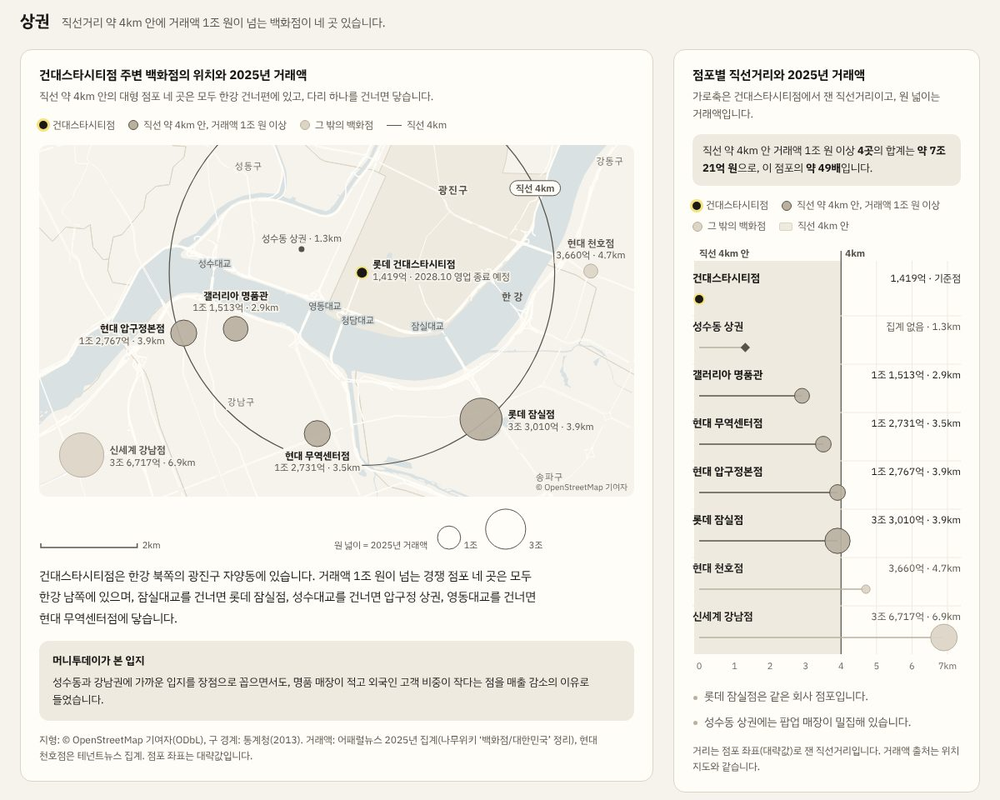
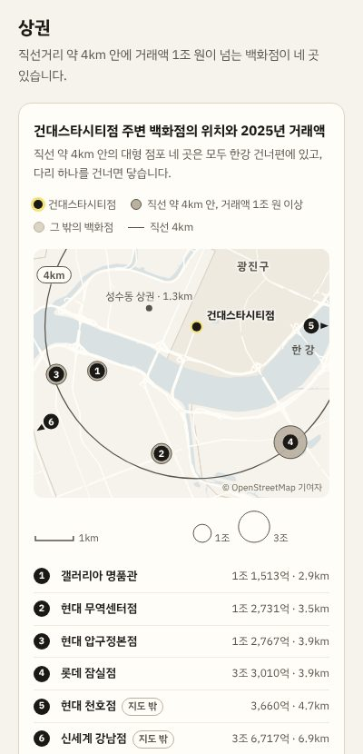

# 위치 지도와 거리 막대

여러 장소의 위치와 규모를 함께 보여 줘야 할 때 쓰는 그림 한 쌍의 규칙입니다. 2026년 10월 5일에 '건대스타시티점 브리핑'(롯데백화점 건대스타시티점의 영업 종료를 분석한 아티팩트)의 상권 구역을 다시 디자인하면서 만들었습니다. 이때 사용자는 시안 세 개 가운데 위치 지도(시안 A)와 거리 막대(시안 B)를 함께 쓰기로 했습니다. 두 그림이 각자 다른 가치를 지니기 때문입니다.

| 파일 | 내용 |
| --- | --- |
| [reference.html](reference.html) | 참조 구현입니다. 브라우저로 바로 열리며, 브리핑의 상권 구역과 같은 코드입니다. |
| [tools/build_geo.py](tools/build_geo.py) | 새 기준점의 지형 데이터(GEO)를 만드는 스크립트입니다. |
| [preview-desktop.jpg](preview-desktop.jpg), [preview-mobile.jpg](preview-mobile.jpg) | 참조 구현을 폭 1440px와 400px로 렌더링한 화면입니다. |
| [../../drafts/location-map-drafts/](../../drafts/location-map-drafts/index.html) | 이 패턴을 고르기 전에 비교한 시안(기존 지도, 시안 A·B·C)입니다. |



## 1. 언제 쓰는가

| 그림 | 보여 주는 것 | 답하는 질문 |
| --- | --- | --- |
| 위치 지도 | 실제 수면, 다리, 도로, 구 경계 위에 놓은 장소와 규모 | 어디에 있고, 무엇을 건너야 닿는가 |
| 거리 막대 | 기준점에서 각 장소까지 잰 직선거리와 규모 | 얼마나 가깝고, 얼마나 큰가 |

- 위치 지도만 쓰면 거리를 눈으로 어림해야 하고, 거리 막대만 쓰면 강이나 방향 같은 공간 정보가 사라집니다. 그래서 두 그림을 한 쌍으로 둡니다.
- 폭이 1200px 이상이면 위치 지도(12칸 가운데 8칸)와 거리 막대(4칸)를 나란히 두고, 그보다 좁으면 위아래로 쌓습니다. 1200px보다 좁은 화면에서 나란히 두면, 거리 막대 카드가 지도 카드보다 최대 130px 길어졌기 때문입니다.
- 장소가 두세 곳뿐이거나 위치 관계가 결론에 영향을 주지 않으면, 이 패턴 대신 표를 씁니다.

## 2. 위치 지도

### 레이어 순서(아래부터)

| 순서 | 레이어 | 스타일 |
| --- | --- | --- |
| 1 | 땅 | `--bg` |
| 2 | 구 경계 | `--line` 1px 선입니다. 기준점이 있는 구만 `--sub`로 칠합니다. |
| 3 | 수면 | `--water`(#D9E1E3)입니다. 아티팩트 디자인의 스타일 표(HANDOFF.md 2절)에 없는 유일한 값입니다. |
| 4 | 도로 | `--card` 색 선이며, 도로 등급에 따라 1px, 1.5px, 2.2px로 그립니다. |
| 5 | 다리 | `--card` 색 2.6px 선입니다. |
| 6 | 기준 원 | `--ink-2` 1.25px 실선 하나입니다. |
| 7 | 장소 | 원 넓이가 값에 비례합니다(아래 '크기'). |
| 8 | 이름표 | 글자 뒤에 바탕색 4px 테두리(halo)를 둡니다. 수면 위의 다리 이름에는 수면색 테두리를 씁니다. |

### 장소 표시

- 기준점은 `--ink` 원(반지름 6px, 좁은 화면 5px)에 노랑(`--hl`) 4px 테두리를 두릅니다.
- 기준 거리 안에 있으면서 값이 큰 장소는 `--line-2` 바탕과 `--ink-2` 테두리로 칠하고, 이름을 굵게 씁니다.
- 그 밖의 장소는 `--line` 바탕과 `--line-2` 테두리로 칠하고, 이름을 조금 덜 굵게 씁니다.
- 값이 없는 장소(예: 성수동 상권)는 `--ink-2` 점(반지름 3.5px)과 이름만 둡니다.
- 장소의 구분은 두 단계까지만 씁니다. 색을 늘리는 대신 이름표와 범례로 구분합니다.

### 크기

- 원 넓이를 값에 비례시킵니다. 따라서 반지름은 값의 제곱근에 비례합니다.
- 가장 큰 값의 반지름은 넓은 화면에서 지도 폭에 따라 20~30px, 좁은 화면에서 19px입니다.
- 축척 막대(넓은 화면 2km, 좁은 화면 1km)와 크기 범례(1조, 3조 원)는 지도 안에 두지 않고 지도 아래 띠에 둡니다.

### 기준 원

- 기준 거리 원은 하나만 그립니다. 기존 지도처럼 2km, 4km, 6km 동심원을 모두 그리면 기준이 흐려집니다.
- 원 라벨('직선 4km')은 `--card` 바탕과 `--ink-2` 테두리로 된 칩 위에 씁니다. 원 선이 글자 사이로 비치지 않게 하기 위해서입니다.
- 원 선이 다른 이름표를 지나가면, SVG 마스크로 이름표 자리에서 원 선을 지웁니다.

### 이름표

- 장소마다 이름표 방향(위, 아래, 왼쪽, 오른쪽)을 정해서 겹침을 피합니다. 기준 원 바로 바깥에 있는 장소는 이름표가 원 바깥으로 가도록 방향을 고릅니다.
- 첫 줄에는 이름, 둘째 줄에는 '값 · 거리'를 씁니다(예: 1조 2,731억 · 3.5km).
- 이름표가 지도 가장자리 밖으로 나가면, 가장자리에서 6px 안쪽으로 밀어 넣습니다.
- 구 이름은 `--ink-3` 11px로 쓰고, 기준점이 있는 구의 이름만 `--ink-2` 12px 굵게 씁니다. 다리 이름은 넓은 화면에서만 씁니다.
- 지도 안의 글자와 번호 배지에는 `pointer-events: none`을 줍니다. 그래야 그 아래에 있는 장소의 툴팁이 작동합니다.

### 좁은 화면(지도 폭 520px 미만)



- 이름표 대신 번호 배지를 달고, 이름과 값은 지도 아래 번호 목록으로 옮깁니다.
- 지도 범위를 기준점 주변으로 좁히고, 범위 밖의 장소는 지도 가장자리에 방향 화살표와 번호를 둡니다. 목록에는 그 장소에 '지도 밖' 표시를 붙입니다.
- 지도를 가로로 밀어서 보는 방식(가로 스크롤)은 쓰지 않습니다.

### 출처 표기

- 지도 오른쪽 아래에 '© OpenStreetMap 기여자'를 적습니다. OpenStreetMap의 라이선스(ODbL)가 이 표기를 요구합니다.
- 카드 아래 출처 줄에는 지형(ODbL), 구 경계, 값의 출처를 적습니다. 장소의 좌표가 대략값이면 그 사실도 적습니다.

## 3. 거리 막대

- 가로축은 기준점에서 잰 직선거리(0~7km)입니다. 원 넓이는 위치 지도와 같은 규칙으로 값에 비례합니다.
- 기준 거리 안쪽을 `--sub` 띠로 칠하고, 기준선을 `--ink-2` 1.25px로 긋습니다. 띠 위에는 '직선 4km 안'과 '4km'를 적습니다.
- 한 줄에 장소 하나를 둡니다. 기준점과 값이 없는 장소도 한 줄씩 넣고, 값이 없으면 '집계 없음'이라고 적습니다.
- 그림 폭이 520px 이상이면 왼쪽 칸(184px)에 이름과 태그(운영사, 같은 회사인지 여부)를 두고, 오른쪽 칸(118px)에 값과 거리를 둡니다.
- 그림 폭이 520px 미만이면 첫 줄에 이름과 '값 · 거리'를 두고, 그 아래 줄에 막대를 그립니다. 이 배치에서는 태그가 빠지므로, 태그의 중요한 내용은 그림 아래 메모 목록으로 옮깁니다. 넓은 배치로 그릴 때는 메모 목록을 숨깁니다.
- 그림 위에는 요약 줄을 둡니다(예: 기준 거리 안 네 곳의 합계와 기준점 대비 배수).
- 줄 전체가 툴팁의 대상입니다. 마우스를 올리면 그 줄의 바탕이 옅게 칠해집니다.

## 4. 데이터

| 자료 | 출처 | 라이선스 |
| --- | --- | --- |
| 수면, 도로, 다리 | OpenStreetMap. OpenFreeMap의 2026년 8월 30일 스냅숏(z14, OpenMapTiles 스키마)을 가공한 [taekie/seoul-3d](https://github.com/taekie/seoul-3d)의 `data/seoul.json` | ODbL. 화면에 '© OpenStreetMap 기여자'를 적습니다. |
| 구 경계 | 통계청 2013년 센서스용 행정구역경계. [southkorea/seoul-maps](https://github.com/southkorea/seoul-maps)의 `kostat/2013/json/seoul_municipalities_geo_simple.json` | 저장소의 라이선스는 Apache-2.0입니다. |
| 장소의 값 | 사례마다 다릅니다. 건대 사례에서는 어패럴뉴스와 테넌트뉴스의 2025년 집계를 썼습니다. | 카드의 출처 줄에 적습니다. |

- `reference.html`에 들어 있는 GEO는 `tools/build_geo.py`로 만든 값이며, ODbL을 따르는 파생 자료입니다. 크기는 약 60KB입니다.
- 좌표는 기준점을 원점으로 한 미터 단위이며, 동쪽이 x, 남쪽이 y입니다. 페이지는 이 값을 확대하고 옮기기만 해서 그립니다.
- 기준 거리 경계에 걸리는 값에는 '약'을 붙입니다. 건대 사례에서 페이지의 점포 좌표로 재면 현대 압구정본점이 3.9km였지만, OpenStreetMap에 있는 점포 위치로 다시 재면 약 4.0km였습니다. 그래서 본문을 '직선 약 4km 안'으로 적었습니다.
- 실제 지형 자료를 구할 수 없으면 개략도로 그리고, 화면에 개략도라는 사실을 밝힙니다(디자인 원칙 1, 8).
- 이 패턴을 만든 작업 환경에서는 Overpass API와 OpenStreetMap API에 접속할 수 없었습니다. 그래서 GitHub에 공개된 가공 자료를 썼습니다. 서울 밖의 지역에는 같은 형식의 자료를 따로 구해야 합니다.

### build_geo.py 실행 예

```
git clone --depth 1 https://github.com/taekie/seoul-3d
curl -O https://raw.githubusercontent.com/southkorea/seoul-maps/master/kostat/2013/json/seoul_municipalities_geo_simple.json
pip install shapely
python3 tools/build_geo.py --city seoul-3d/data/seoul.json \
  --districts seoul_municipalities_geo_simple.json \
  --center 127.0702,37.5386 --klat 37.527 \
  --bbox 126.975,37.488,127.152,37.566 \
  --bridge 성수대교=127.0350,37.5364 --bridge 영동대교=127.0571,37.5300 \
  --bridge 청담대교=127.0644,37.5265 --bridge 잠실대교=127.0920,37.5239 \
  --bridge 천호대교=127.1111,37.5433 \
  --out geo.json
```

- `--center`는 기준점, `--bbox`는 남길 범위입니다. `--bridge`로 적은 다리는 수면 위 구간을 따로 뽑아서 굵게 그립니다.
- `--klat 37.527`은 건대 사례에서 점포 좌표의 축척을 맞추려고 넣은 값입니다. 새 지역에서 이 값을 빼면 기준점의 위도를 씁니다.
- 위 명령은 `reference.html`에 들어 있는 GEO와 같은 결과를 냅니다(2026-10-05 확인).

## 5. 새 지도에 적용하는 순서

1. 기준점, 비교할 장소(이름, 좌표, 값), 기준 거리를 정합니다.
2. `tools/build_geo.py`로 GEO를 만듭니다. 범위(`--bbox`)는 가장 먼 장소까지 들어가도록 잡습니다.
3. `reference.html`을 복사해서 `GEO`, `ST`(장소 목록), `SS`(값이 없는 장소)를 바꿉니다. 이어서 이름표 방향(`LAB`), 다리 이름 위치(`BL`), 지도 범위(`EX`), 구 이름 위치(`DL`)를 새 지역에 맞춥니다.
4. 기준 거리가 4km가 아니면, 코드에서 4km에 해당하는 값(`4000`, `X(4)`, `k !== 4`)과 '4km'가 들어간 문구(범례, 라벨, 요약 줄)를 함께 바꿉니다. 가로축의 끝(`DMAX`)도 가장 먼 장소에 맞춥니다.
5. 아래 점검 목록에 따라 확인합니다.

## 6. 점검 목록

- 폭 1440, 1199, 1101, 961, 800, 700, 560, 400, 320px에서 렌더링해서 가로 넘침, 겹침, 잘림, 스크립트 오류가 없는지 확인합니다(디자인 원칙 6).
- 원 선이 이름표 글자 사이로 비치지 않는지, 이름표가 지도 밖으로 나가지 않는지 확대해서 봅니다.
- 폭 1200px 이상에서 두 카드의 높이 차이를 확인합니다. 건대 사례에서는 1200px에서 45px, 1300px 이상에서 13px이었습니다.
- 명암비: 가장 낮은 글자는 구 이름과 출처 표기(`--ink-3`)이며, 바탕 위에서 4.93:1입니다. `--ink-3` 글자는 `--sub` 면 위에 두지 않습니다.
- 툴팁: 장소, 기준점, 값이 없는 장소, 거리 막대의 각 줄에 마우스를 올리거나 키보드로 초점을 옮겨서 확인합니다. 좁은 화면에서는 번호 배지 위에서도 툴팁이 나와야 합니다.

## 7. 비교한 시안과 결정(2026-10-05)

| 안 | 내용 | 결정 |
| --- | --- | --- |
| 기존 지도 | 개략적인 강과 2km, 4km, 6km 점선 동심원으로 그린 지도입니다. 좁은 화면에서는 지도를 가로로 밀어서 봐야 했습니다. | 바꿈 |
| 시안 A | 실제 지형 위에 그린 위치 지도 | 채택 |
| 시안 B | 거리 막대 | 채택(시안 A와 함께) |
| 시안 C | 기존 도식을 다듬은 지도(매끈한 강, 기준 원 하나) | 고르지 않음 |
