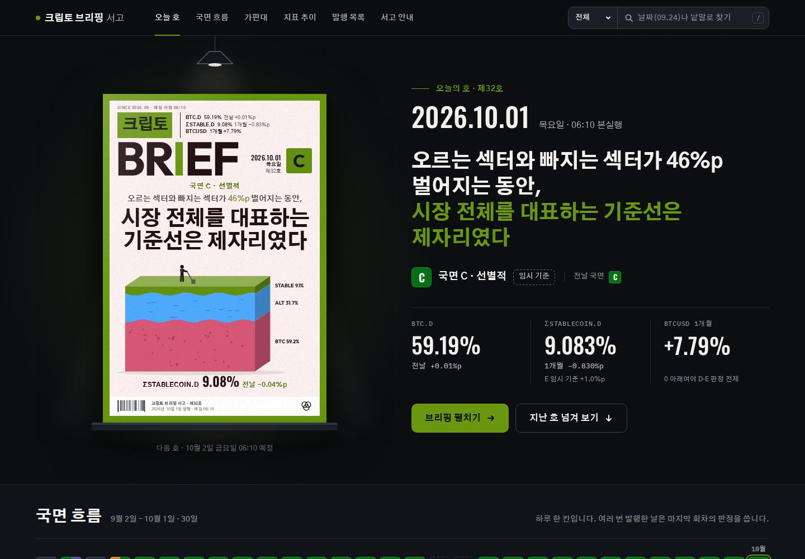

# book_design: 크립토 브리핑 서고의 표지와 페이지 디자인 작업 기록

이 저장소는 2026년 9월 30일부터 10월 1일까지 Claude와 함께 진행한 표지·페이지 디자인 작업을 처음부터 끝까지 모아 둔 기록입니다. 작업은 서점과 경제주간지의 실제 표지를 조사하는 일에서 시작했습니다. 그 조사를 바탕으로 매일 아침 발행되는 크립토 브리핑에 잡지형 표지를 붙였고, 표지를 담는 서고 페이지를 세 가지 테마로 그려 보았습니다. 그다음 디자인 명세의 형식을 바꿔 가며 두 차례 실험했고, 마지막에는 가장 마음에 든 시안을 실제 서고에 적용했습니다.

코드, 명세, 데이터, 분석 결과, 화면 캡처, 하위 작업에 준 지시문과 보고를 모두 담았습니다. 다만 이 저장소는 공개 저장소이므로, 저작권이 다른 곳에 있는 표지 이미지(서점 도서 표지, 경제주간지 표지)는 넣지 않았습니다. 무엇을 왜 뺐는지는 [docs/09_공개_범위와_제외_항목.md](docs/09_공개_범위와_제외_항목.md)에 정리했습니다.

이 작업을 이어받는다면 [HANDOFF.md](HANDOFF.md)(현재 상태, 사용자가 고른 것, 남은 일)와 [AGENTS.md](AGENTS.md)(작업 규칙과 디자인 개선 절차)부터 읽으면 됩니다.



## 작업 순서

| 순서 | 일시(한국 시간) | 작업 | 주요 결과물 | 문서 |
| --- | --- | --- | --- | --- |
| 1 | 9/30 오후 | 서점 3곳의 주간 베스트셀러 150권 표지 수집 | 표지 압축 파일(앞표지·뒷표지·책등 376장), 도서목록.csv | [01](docs/01_서점_베스트셀러_표지.md) |
| 2 | 9/30 18시~21시 | 경제주간지 2종(매경이코노미, 한경비즈니스) 표지 75장 디자인 분석 | 분석 문서(본문, 코딩북, 표지별 코딩), 코딩 CSV | [02](docs/02_주간지_표지_분석.md) |
| 3 | 9/30 21시~23시 | 브리핑마다 잡지형 표지를 그리는 표지 모듈 제작 | `mz.js`(배색 12종, 그림 44종), 표지 시안 캔버스 | [03](docs/03_잡지형_표지_모듈.md) |
| 4 | 9/30 23시 | 표지 모듈을 실제 서고에 적용 | 서고 6번째 판 | [07](docs/07_서고_적용_이력.md) |
| 5 | 9/30 23시 무렵 | 서고 페이지 테마 시안 3종 | 밤의 가판대, 편집국 1면, 달력 벽 | [04](docs/04_서고_테마_시안.md) |
| 6 | 9/30 23시~10/1 1시 | 1차 실험: YAML 명세와 JSON 명세 비교 | 명세 6개, 구현 페이지 6개 | [05](docs/05_명세_형식_실험_1차.md) |
| 7 | 10/1 오전 | 프롬프트 작성 방법 문의와 답변 | 브리프+토큰, XML 태그 작성법 | [08](docs/08_프롬프트_작성_안내.md) |
| 8 | 10/1 10시~12시 | 2차 실험: 브리프+토큰, XML 태그, 명세 없이 바로 만들기, 블라인드 평가 | 명세 6개, 구현 페이지 9개, 평가자 6명의 채점 36건 | [06](docs/06_명세_형식_실험_2차.md) |
| 9 | 10/1 12시 무렵 | 밤의 가판대 YAML 시안의 구성과 배치를 실제 서고에 적용 | 서고 7번째 판 | [07](docs/07_서고_적용_이력.md) |
| 10 | 10/1 밤 | 이 저장소 정리 | 이 저장소 | [00](docs/00_작업_일지.md) |
| 11 | 10/2 새벽 | 다른 AI가 이어받을 수 있도록 인계 문서와 작업 지침 작성 | HANDOFF.md, AGENTS.md | [00](docs/00_작업_일지.md) |

요청과 결정을 시간순으로 따라가려면 [docs/00_작업_일지.md](docs/00_작업_일지.md)부터 읽으면 됩니다.

## 폴더 안내

```
book_design/
├── README.md              이 파일
├── HANDOFF.md             인계 문서: 현재 상태, 사용자가 고른 것, 남은 일
├── AGENTS.md              작업 지침: 규칙과 디자인 개선 절차
├── docs/                  작업 일지와 단계별 설명 문서
├── bookstore_covers/      1단계: 서점 베스트셀러 표지 수집 기록(도서 목록과 파일 목록만 포함)
├── magazine_analysis/     2단계: 경제주간지 표지 분석(보고서, 코딩 데이터, 계산 스크립트, 차트)
├── cover_design/          3~9단계: 표지 모듈, 서고 페이지 판본, 테마 시안, 두 차례 실험, 평가
├── canvas/                디자인 캔버스 '크립토 브리핑 표지 시안'의 프로젝트 파일
└── agents/                작업 중에 하위 에이전트 37개에 맡긴 작업의 지시문과 최종 보고
```

폴더마다 README가 있어서, 파일이 어떤 단계에서 어떻게 쓰였는지 따로 설명합니다.

| 찾는 것 | 위치 |
| --- | --- |
| 표지 모듈 소스 | `cover_design/parts/*.js` → `cover_design/mz.js`, `cover_design/mz.css` |
| 지금 서고에 올라가 있는 페이지(7번째 판) | `cover_design/library_night/final.html`, 원본 `src.html` |
| 그 이전 판(5번째, 6번째) | `cover_design/page/src.html`(5번째 판), `cover_design/page/final.html`(6번째 판) |
| 테마 시안 3종 | `cover_design/themes/` |
| 1차 실험(YAML, JSON) 명세와 결과 | `cover_design/experiment/` |
| 2차 실험(브리프+토큰, XML 태그, 명세 없이) 명세와 결과 | `cover_design/experiment2/` |
| 블라인드 평가의 평가지와 점수 | `cover_design/judge/`, `cover_design/experiment2/blind_scores.csv` |
| 주간지 분석 보고서 | `magazine_analysis/report/1_본문.md` |
| 주간지 표지 75장의 코딩 결과 | `magazine_analysis/analysis/out/주간지_표지_코딩_2026.csv` |
| 하위 작업 지시문 | `agents/` |

## 결과물 링크

아래 결과물은 Claude 앱 안의 아티팩트로 만들어졌습니다. 모두 소유자만 열 수 있는 비공개 링크이므로, 이 저장소를 보는 다른 사람은 열 수 없습니다.

| 결과물 | 종류 | 링크 |
| --- | --- | --- |
| 크립토 브리핑 서고 | 웹 페이지(실제 서고) | https://claude.ai/artifact/QnnPspYTfZKGGNSUpZsVNr |
| 크립토 브리핑 표지 시안 | 디자인 캔버스(5개 페이지, 보드 39개) | https://claude.ai/artifact/JJpmYZbrGDqb3oqdkD4iwp |
| 2026 경제주간지 표지 디자인 분석: 매경이코노미·한경비즈니스 75장 | 문서(탭 3개) | https://claude.ai/artifact/7Mvt61zfnR9zMnE9idvpfd |

## 다시 만들어 보기

작업 환경에서는 폴더가 `/home/claude/cover_design`, `/home/claude/covers`에 있었고, 스크립트도 이 절대 경로를 그대로 씁니다. 기록을 바꾸지 않으려고 경로를 고치지 않았으므로, 다시 실행하려면 같은 경로에 폴더를 두거나 스크립트 안의 경로를 바꿔야 합니다.

```sh
# 1. 같은 경로로 연결한다(또는 스크립트의 경로를 바꾼다)
sudo mkdir -p /home/claude
sudo ln -s "$PWD/cover_design" /home/claude/cover_design
sudo ln -s "$PWD/magazine_analysis" /home/claude/covers

# 2. 글꼴(@fontsource)과 렌더링 도구를 설치한다
cd cover_design && npm install          # node_modules/@fontsource/* 를 받는다
pip install playwright && playwright install chromium

# 3. 표지 모듈을 조립하고, 미리보기 하네스와 서고 페이지를 만든다
sh build_mz.sh                          # parts/*.js → mz.js
python3 mkh.py                          # h.html(표지 미리보기 하네스)
python3 library_night/build.py          # 7번째 판 final.html과 로컬 미리보기 preview.html

# 4. 화면을 캡처한다
python3 shot.py shelf out/shelf.png                 # 하네스 모드: shelf, big, row, catalog, schemes
python3 library_night/shot.py /tmp/lib 1440 820 390 # 서고 미리보기를 여러 폭으로 캡처

# 5. 실험 페이지를 다시 빌드하고 캡처한다(1차는 experiment, 2차는 experiment2)
cd experiment && python3 build.py night_yaml && python3 shot.py night_yaml /tmp/night_yaml.png
```

- `preview.html` 파일들은 내려받은 글꼴(`../node_modules/@fontsource/…`)과 데이터 사본(`../data.js`, `db_snapshot.json`)을 써서 인터넷 없이 열립니다. 시계는 캡처 시점(2026년 9월 30일 또는 10월 1일)에 고정해 두었습니다.
- 실제 서고(`final.html`)는 Claude 아티팩트 실행 환경의 데이터베이스(`claude.use('db')`)에서 브리핑 기록을 읽으므로, 그 환경 밖에서는 데이터가 비어 있는 상태로 보입니다.
- 용량을 줄이려고 큰 PNG 화면 캡처는 JPEG(품질 85)로 바꿨습니다. 그래서 스크립트가 출력하는 이름은 `.png`이지만 저장소에는 같은 이름의 `.jpg`가 있습니다. 명세나 지시문이 직접 가리키는 원래 시안 캡처(`originals/*.png`)는 PNG 그대로 두었습니다.

## 저작권과 공개 범위

- 서점 도서 표지와 경제주간지 표지는 각 출판사와 잡지사에 권리가 있으므로 넣지 않았습니다. 대신 도서 목록, 표지 출처 URL, 파일 목록, 분석 결과처럼 사실 정보만 넣었습니다.
- 표지 모듈이 그린 브리핑 표지, 서고 페이지, 시안, 차트는 이 작업에서 새로 만든 것입니다.
- 브리핑 기록 사본(`cover_design/data.js`, `cover_design/library_night/db_snapshot.json`)에는 브리핑 제목과 헤드라인, 시장 지표, 브리핑 아티팩트 링크가 들어 있습니다. 링크는 비공개 아티팩트를 가리키므로 다른 사람은 열 수 없습니다.
- 자세한 내용은 [docs/09_공개_범위와_제외_항목.md](docs/09_공개_범위와_제외_항목.md)에 있습니다.
