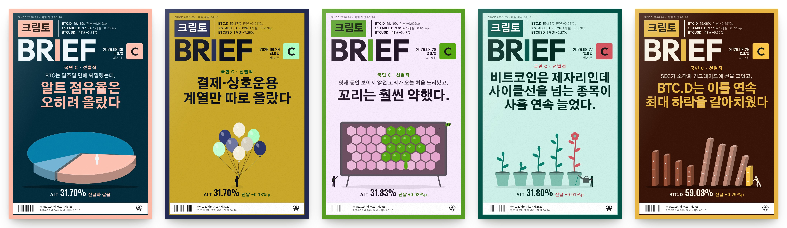
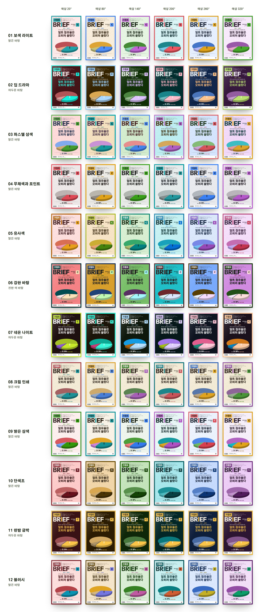
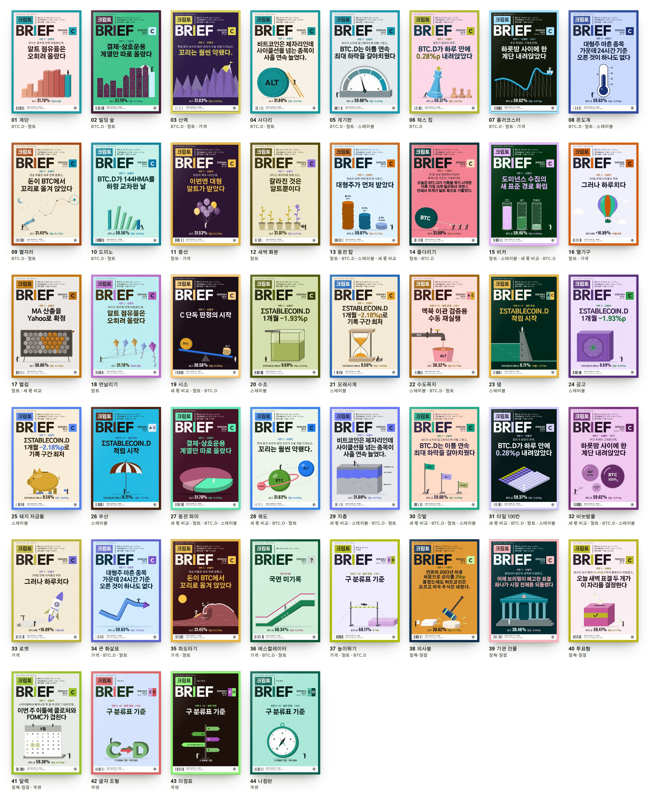

# 3. 잡지형 표지 모듈

'크립토 브리핑 서고'는 매일 06:10(한국 시간)에 발행되는 크립토 시장 브리핑을 날짜별로 모아 두는 페이지입니다. 브리핑마다 표지 한 장이 붙습니다. 이 단계에서는 브리핑 한 편을 잡지 한 호로 보고, 그날 기록을 바탕으로 잡지 표지를 자동으로 그리는 모듈을 만들었습니다. 모듈 이름은 파일 이름을 따서 `mz`, 코드 안의 객체 이름은 `BK`입니다.



## 진행 과정

| 시점 | 내용 | 파일 |
| --- | --- | --- |
| 9/30 21시 무렵 | 서고 데이터베이스의 브리핑 기록 31건(9/2~9/30)을 읽어 사본을 만들었습니다. 이때 서고(5번째 판)는 브리핑 한 편을 책 한 권으로 보고 책 표지를 그리고 있었습니다. | `data.js`, `briefs.json`, `page/src.html` |
| 9/30 21시 30분 무렵 | **시안 1**: 모든 호에 같은 틀(연두색 테두리, 제호, 커버라인 3줄, 하단 띠)을 쓰고, 국면별 색과 그날 수치로 그린 물건 네 종류(계단, 수조, 동전, 글자)를 넣었습니다. | `mz_v1.js`, `mz_v1.css`, `p_top.jpg`, `phases.jpg`, `out/covers_row.jpg`, `out/shelf_all.jpg` |
| 9/30 22시~23시 | **시안 2**: 색과 그림을 다양하게 해 달라는 요청에 따라 배색 12종과 날마다 도는 기준 색상, 그림 44종을 더했습니다. | `parts/*.js` → `mz.js`, `mz.css`, `final/*.jpg` |
| 9/30 23시 | 시안 2를 실제 서고에 적용했습니다(6번째 판). | [07_서고_적용_이력.md](07_서고_적용_이력.md) |

## 설계

### 고정하는 것: 한 잡지로 읽히게 하는 틀

테두리의 위치와 두께, '크립토' 블록과 BRIEF 제호, 제호 옆 커버라인 3줄, 하단의 흰 띠(바코드, 발행 정보)는 매일 같은 자리에 둡니다. 색만 호마다 바뀌기 때문에, 서가에 여러 호가 꽂혀도 한 잡지로 읽힙니다.

### 표제: 킥커, 도입절, 본표제의 3단

헤드라인을 마지막 쉼표 앞뒤로 나눠, 국면을 알리는 킥커, 쉼표 앞의 도입절, 쉼표 뒤의 본표제를 차례로 놓습니다. 단위가 붙은 숫자만 강조색으로 표시합니다. 어두운 배색에서는 본표제를 테두리 색으로 써서 한 호 안에서 색이 이어지게 합니다. 표지가 페이지에 들어간 뒤에는 `BK.fit()`이 본표제 글자 크기를 줄여 가며 세 줄이 칸 안에 들어가게 맞춥니다.

### 배색: 규칙 12종 × 기준 색상

- 배색 규칙은 보색 라이트, 딥 드라마, 파스텔 삼색, 무채색과 포인트, 유사색, 강한 바탕, 네온 나이트, 크림 인쇄, 밝은 삼색, 단색조, 한밤 금박, 블러시의 12종입니다. 규칙마다 바탕, 글자, 테두리, 그림 3색의 명도·채도·색상 차이를 OKLCH로 정해 둡니다.
- 기준 색상은 날짜 일련번호 × 137.508°(같은 날 2회차부터는 회차마다 57°를 더함)입니다. 하루에 137.5°씩 색상환을 돌기 때문에 이웃한 날짜끼리 색이 비슷해지지 않습니다.
- 규칙은 날짜 순서대로 `[0,5,1,8,3,2,6,9,7,4,10,11]`을 돕니다. 그래서 어두운 배색은 나흘에 한 번 나옵니다. 경고 성격인 D·E 국면에는 어두운 배색만 씁니다.
- 강조 글자와 본표제는 바탕과의 명암비가 4.6 이상이 되도록 밝기를 자동으로 보정합니다. 그림 색은 밝은 바탕에서 1.55 이상, 어두운 바탕에서 2.1 이상이 되게 합니다.



### 그림: 44종 가운데 하나를 고른다

1. **주제를 정합니다.** 헤드라인 본표제, 도입절, (헤드라인이 없으면) 비고, 전날보다 가장 크게 움직인 지표(0.15%p 이상), 세 몫 비교의 순서로 그날 표지가 다룰 주제를 찾습니다. 주제는 BTC.D, 알트, 스테이블, 세 몫 비교, 가격, 정책·일정, 국면 가운데 하나입니다.
2. **후보를 추립니다.** 그 주제를 그릴 수 있고 필요한 수치가 있는 그림만 남깁니다.
3. **낱말을 맞춥니다.** '계단', '꼬리', '표결', '앞장'처럼 헤드라인에 나온 낱말에 맞는 그림을 먼저 고릅니다.
4. **반복을 피합니다.** 최근 12호 안에 나온 그림은 건너뜁니다. 낱말이 맞고 7호 이상 지났으면 다시 쓸 수 있습니다. 그 결과 9월의 31장에는 30종의 그림이 나옵니다.
5. **형태를 수치로 정합니다.** 계단의 높이, 수조의 수위, 조각의 크기, 사다리 위의 위치, 연속 하락 일수, 기울기 같은 형태는 그날 기록된 수치에서 나옵니다.

배치 계획(`BK.plan`)은 과거 호만 보고 날짜순으로 정하므로, 새 호가 추가되어도 지난 표지는 바뀌지 않습니다.

| 주제 | 그림 |
| --- | --- |
| BTC.D | 계단, 빌딩 숲, 산맥, 사다리, 계기판, 체스 킹, 롤러코스터, 온도계, 별자리, 도미노 |
| 알트 | 풍선, 새싹 화분, 동전 탑, 줄다리기, 비커, 열기구, 벌집, 연날리기 |
| 스테이블 | 수조, 모래시계, 수도꼭지, 댐, 금고, 돼지 저금통, 우산 |
| 세 몫 비교 | 시소, 동전 파이, 궤도, 지층, 깃발, 타일 100칸, 비눗방울 |
| 가격 | 로켓, 큰 화살표, 파도타기, 에스컬레이터, 높이뛰기 |
| 정책·일정 | 의사봉, 기관 건물, 투표함, 달력 |
| 국면(지표가 없는 날) | 글자 조형, 이정표, 나침반 |

표에는 그림마다 주로 맡는 주제 하나만 적었습니다. 여러 주제에 쓰이는 그림도 있습니다(예: 계기판은 BTC.D, 알트, 스테이블에 모두 쓰입니다).



## 분석 결과와 연결되는 설계 결정

2단계의 주간지 분석에서 나온 결과 가운데 다음 네 가지를 표지 설계의 근거로 썼습니다. 이 표는 설계 근거를 저장소에 남기려고 다시 정리한 것입니다.

| 표지 설계 | 근거가 된 분석 결과 |
| --- | --- |
| 모든 호에 같은 틀(테두리, 제호 블록, 커버라인 칸, 하단 띠) | 매경이코노미는 38장 모두 주황 테두리와 고정 칸을 써서 한 잡지로 읽힙니다. |
| 킥커, 도입절, 본표제의 3단 표제와 숫자 강조 | 한경비즈니스는 표제의 68%가 부제를 달고, 킥커·본표제·덱으로 위계를 나누며 숫자를 앞세웁니다. |
| 그날 주제를 은유하는 그림 한 개 | 매경이코노미는 개념 은유형이 58%, 중앙 오브젝트 배치가 74%입니다. |
| 호마다 다른 배색 | 색채감이 높은 한경비즈니스처럼 색으로 호를 구별하되, 틀은 고정해 시리즈로 읽히게 했습니다. |

## 파일

| 파일 | 내용 |
| --- | --- |
| `cover_design/parts/00_core.js` | 기본 함수, OKLCH 색 변환, 명암비 보정, 배색 12종(`SCH`), 순환표(`CYC`), 기준 색상 |
| `cover_design/parts/10_data.js` | 헤드라인 나누기, 숫자 강조, 주제 판단(`focusOf`), 수치 정리(`info`), 배치 계획(`planOf`) |
| `cover_design/parts/20_kit.js` | 그림 도구(입체 상자, 원기둥, 동전 등). 좌표계는 `viewBox 0 0 100 147` |
| `cover_design/parts/30_btc.js` ~ `34_price.js` | 그림 44종(BTC.D, 알트, 스테이블, 세 몫, 가격·정책·국면) |
| `cover_design/parts/90_tail.js` | 고정 틀, 표지 HTML 조립(`html`), 표제 맞추기(`fit`), 공개 함수 |
| `cover_design/build_mz.sh` | `parts/*.js`를 이어 붙여 `mz.js`를 만듭니다. |
| `cover_design/mz.js`, `mz.css` | 완성된 모듈(시안 2) |
| `cover_design/mz_v1.js`, `mz_v1.css` | 시안 1 |
| `cover_design/BRIEF.md` | 표지 설계 메모(작업용) |
| `cover_design/harness.html` → `h.html` | 표지 미리보기 하네스. `mkh.py`가 `mz.js`를 넣어 `h.html`을 만들고, 주소 뒤의 `#shelf`, `#big`, `#row`, `#catalog`, `#schemes`로 보기 방식을 고릅니다. |
| `cover_design/plan.js` | Node로 31호의 배치 계획(주제, 그림, 배색, 색상)을 출력해 확인하는 스크립트 |
| `cover_design/shot.py`, `cshot.py`, `mshot.py`, `pshot.py`, `tshot.py`, `finalshots.py`, `cap.py`, `dbg*.py` | 하네스와 페이지를 캡처하고 점검한 스크립트 |
| `cover_design/final/` | 캔버스에 올린 최종 이미지(최근 5호, 전체 31장, 그림 44종, 배색 12종, 모바일, 서고 첫 화면) |
| `cover_design/out/` | 시안을 다듬는 동안 남긴 중간 캡처 |
| `cover_design/*.jpg` | 시안 1을 하네스와 서고 미리보기에 넣어 확인한 캡처(`big*`, `hero`, `p_top`, `phases`, `shelf`) |

## 공개 함수

```js
BK.html(brief, allBriefs, vol, force)   // 표지 한 장의 HTML. force로 그림·배색·색상을 지정할 수 있다
BK.fit(root, force)                     // 페이지에 들어간 표지의 본표제 크기를 칸에 맞춘다
BK.plan(allBriefs)                      // 호마다 {focus, scene, scheme, hue} 배치 계획
BK.pick(brief, allBriefs, force)        // "그림 · 배색 · 색상" 설명 문자열
BK.palette(schemeIndex, hue)            // 배색 값
BK.contrast(hexA, hexB)                 // 두 색의 명암비
BK.scenes, BK.schemes                   // 그림 44종과 배색 12종의 목록
BK.can, BK.focus, BK.grain              // 그림 사용 가능 여부, 주제 판단, 종이 질감
```
