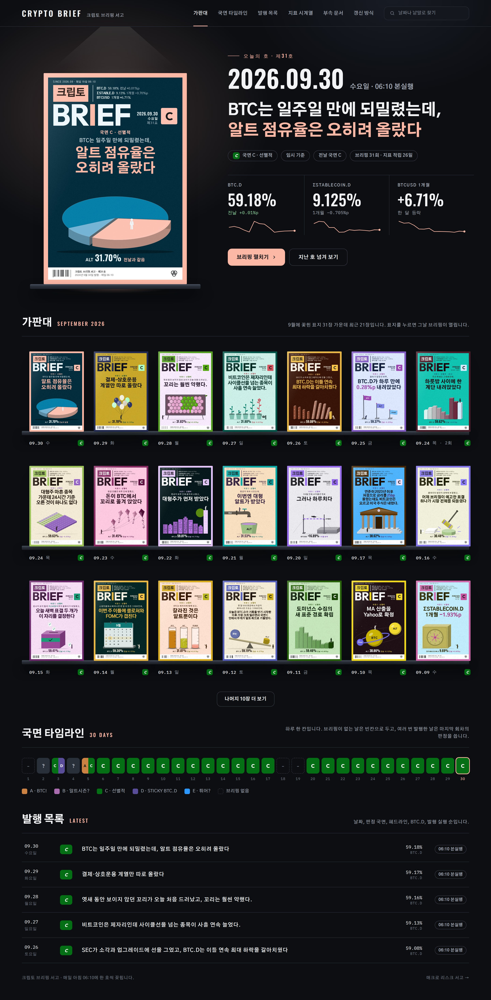
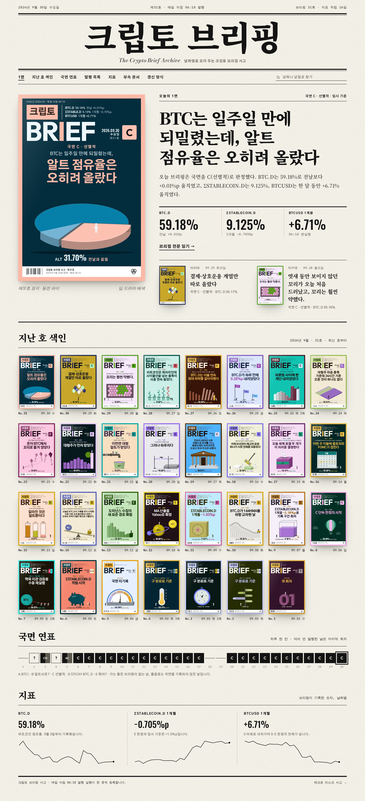
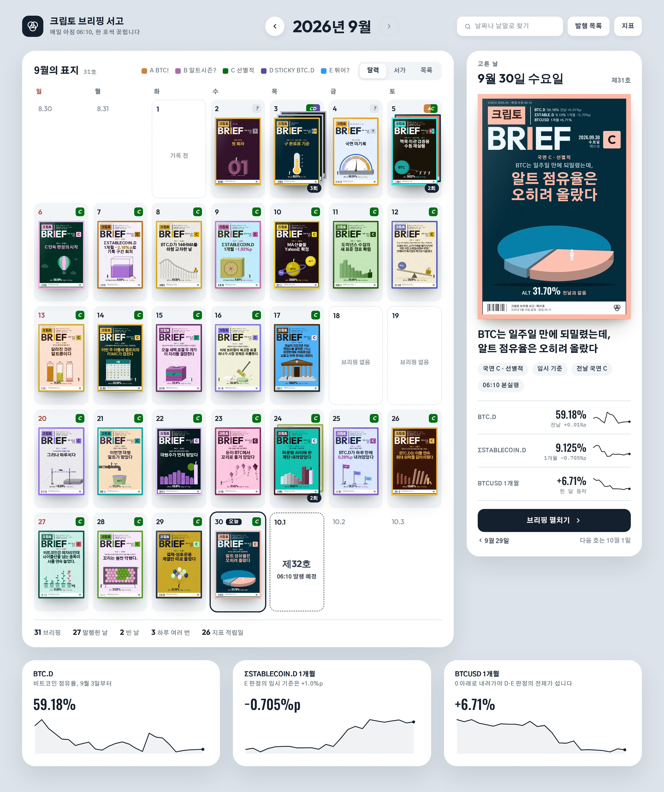

# 4. 서고 테마 시안 3종

표지 모듈을 서고에 적용한 뒤, 표지를 담는 서고 페이지 자체(배경, 테마, 배치)를 새로 그려 보았습니다. 세 시안은 모두 같은 브리핑 기록 31건과 같은 표지 모듈을 쓰고, 폭 1440px 데스크톱 화면 한 장으로 만들었습니다. 결과는 디자인 캔버스 「크립토 브리핑 표지 시안」의 '서고 테마 시안' 페이지에 올렸습니다.

## 시안 1 · 밤의 가판대

- **콘셉트**: 밤에 불이 켜진 신문 가판대입니다. 거의 검은 바탕에서 표지만 조명을 받아 빛납니다. 최신 호는 스포트라이트 아래 크게 세우고, 지난 호는 선반 위에 줄지어 세웁니다. 페이지 강조색은 그날 표지의 테두리 색을 따라가므로, 날마다 페이지 분위기가 조금씩 바뀝니다.
- **구성**: 상단 막대(로고, 메뉴, 검색) → 히어로(왼쪽 스포트라이트 아래 최신 호 표지 420px, 오른쪽 날짜 72px, 헤드라인 46px, 국면 칩, 지표 3개와 작은 추세선, 버튼 2개) → 가판대(선반 3줄 × 7장, 표지 160px, "나머지 10장 더 보기") → 국면 타임라인(30칸) → 발행 목록(최근 5개) → 바닥글.
- **특징**: 표지 색이 가장 선명하게 살아나는 구성입니다.

## 시안 2 · 편집국 1면

- **콘셉트**: 흑백 신문 1면입니다. 종이색 바탕에 검은 잉크, 굵은 괘선과 가는 괘선, 명조 제호를 씁니다. 페이지에는 색을 쓰지 않고 표지만 컬러로 두어, 표지가 1면 사진 기사처럼 보이게 합니다.
- **구성**: 날짜 줄 → 제호 "크립토 브리핑"(Noto Serif KR 900, 132px)과 영문 부제 → 메뉴와 검색 → 1면(왼쪽 최신 호 표지 500px와 캡션, 오른쪽 킥커, 명조 헤드라인 64px, 해설 문단, 지표 3개, "브리핑 전문 읽기", 지난 두 호) → 지난 호 색인(8열 × 4줄, 표지 31장) → 국면 연표(30칸, 흑백) → 지표(추세선 3개) → 판권.
- **특징**: 제호, 1면 기사, 지난 호 색인, 국면 연표, 지표 순으로 읽혀서 글이 많은 브리핑과 잘 맞습니다.

## 시안 3 · 달력 벽

- **콘셉트**: 월간 달력입니다. 날짜 칸마다 그날 표지를 넣어, 어느 날 발행했고 어느 날 비었는지, 하루에 여러 번 발행한 날이 언제인지 한눈에 보이게 합니다. 옅은 청회색 바탕에 흰 카드를 씁니다.
- **구성**: 머리(로고, 월 이동 "2026년 9월", 검색, 발행 목록, 지표) → 본문 두 칸(왼쪽 달력 카드: 요일 줄, 5주 × 7일, 칸마다 날짜·국면 표식·표지, 여러 회차는 겹쳐 쌓고 "3회" 배지, 빈 날은 점선 칸 "브리핑 없음", 10월 1일은 "제32호 06:10 발행 예정" / 오른쪽 고른 날 카드: 날짜, 표지 332px, 헤드라인, 칩, 지표 3줄과 추세선, "브리핑 펼치기") → 아래 지표 카드 3개.
- **특징**: 날짜로 찾기가 가장 쉬운 구성입니다.

## 반응과 그 뒤

세 시안 가운데 밤의 가판대가 "일단 마음에 든다"는 반응을 받았습니다. 이어서 이 세 시안을 '원래 시안'으로 삼아, 디자인 명세의 형식이 결과에 어떤 영향을 주는지 두 차례 실험했습니다([05](05_명세_형식_실험_1차.md), [06](06_명세_형식_실험_2차.md)). 위의 콘셉트와 구성 설명은 실험 브리프(`experiment/brief_*.md`)에 적은 내용을 옮긴 것입니다.

## 파일

| 파일 | 내용 |
| --- | --- |
| `cover_design/themes/night.src.html`, `paper.src.html`, `calendar.src.html` | 시안 원본. `<<MZ>>`와 `<<COMMON>>` 자리에 표지 모듈과 공용 도우미가 들어갑니다. |
| `cover_design/themes/common.js` | 공용 도우미: 브리핑 기록 정리, 날짜·요일·국면 표시, 표지 감싸기, 지표 함수 |
| `cover_design/themes/build_themes.py` | `python3 build_themes.py night paper calendar` → `*.html` |
| `cover_design/themes/night.html`, `paper.html`, `calendar.html` | 빌드한 시안 |
| `cover_design/final/theme_*.jpg` | 캔버스에 올린 전체 화면 캡처 |
| `cover_design/out/t_*.jpg` | 시안을 다듬는 동안 남긴 캡처 |
| `cover_design/experiment/originals/*.png` | 실험 브리프에 붙인 원래 시안 캡처(위아래로 나눈 조각 포함) |
