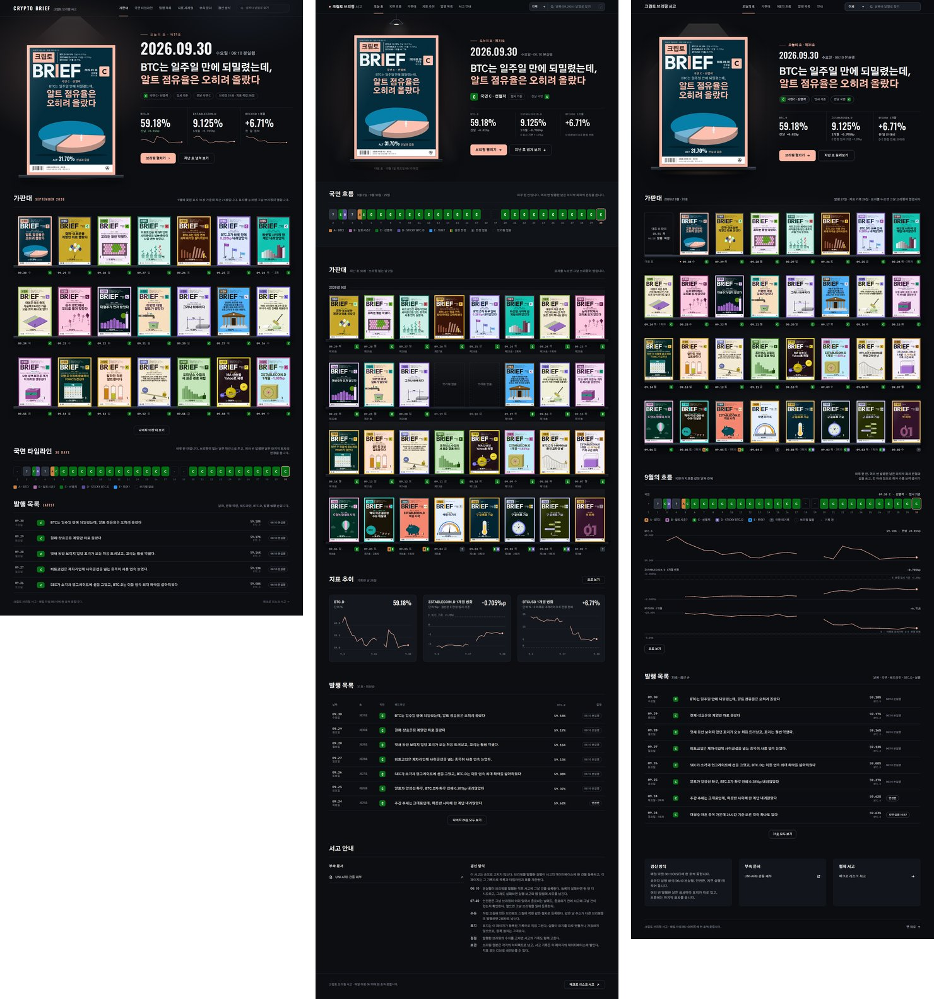
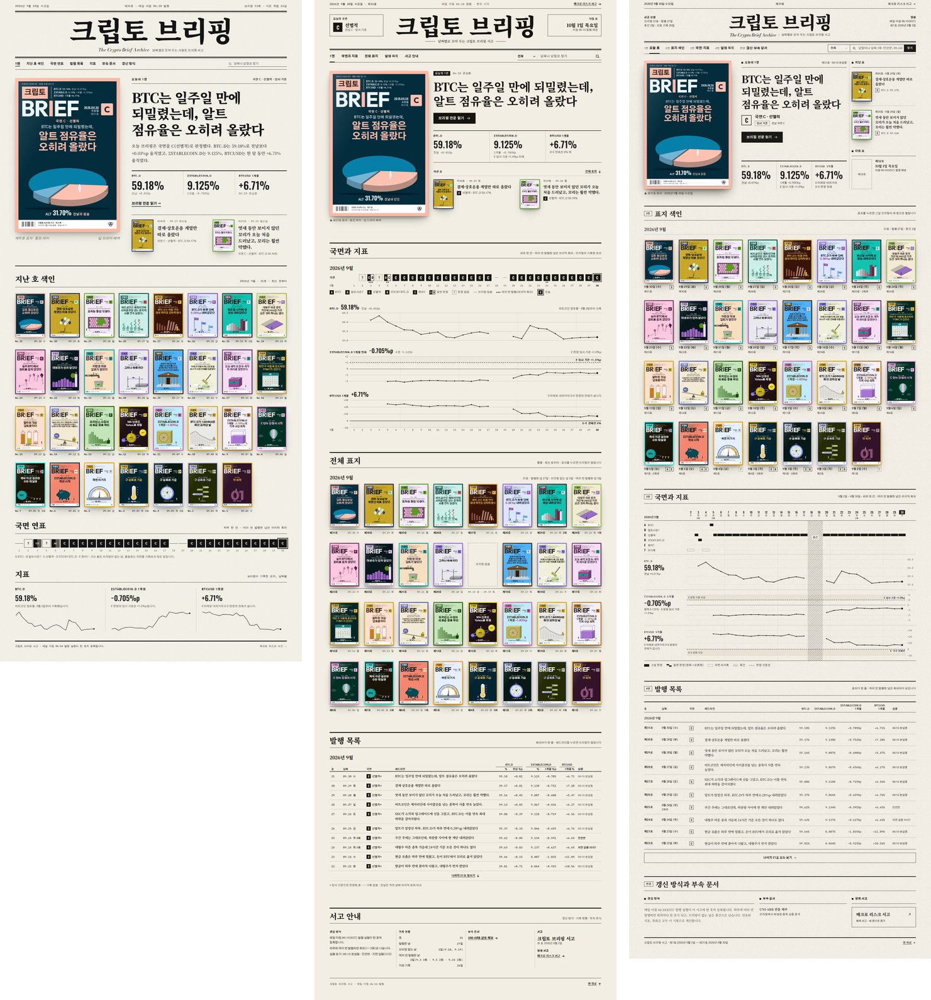
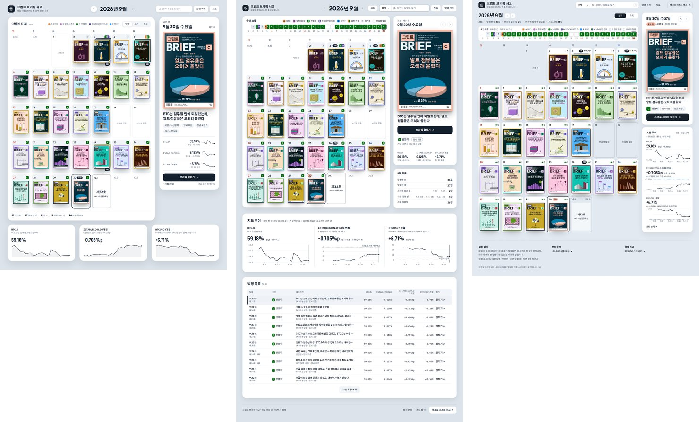

# 5. 1차 실험: YAML 명세와 JSON 명세

테마 시안 3종을 본 뒤, 디자인 지시를 YAML이나 JSON 같은 구조화된 명세로 쓰면 결과가 더 좋아지는지 알아보았습니다. 같은 브리프에서 출발해 형식만 다른 명세를 쓰고, 명세만 보고 페이지를 만들게 해서 결과를 비교했습니다.

## 실험 설계

```
원래 시안(테마별 1개) + 공통 브리프
        │
        ├─ 명세 작성자 A ── YAML 명세 ── 구현자 A ── 페이지 (night_yaml 등)
        └─ 명세 작성자 B ── JSON 명세 ── 구현자 B ── 페이지 (night_json 등)
```

- **명세 작성자**(하위 에이전트 6개, 테마마다 YAML 1개와 JSON 1개): 공통 브리프(`brief_common.md`), 테마 브리프(`brief_<테마>.md`), 원래 시안 캡처를 읽고 명세 한 개를 썼습니다. 두 형식의 지시문은 형식 이름, 형식별 규칙(YAML은 색상값을 따옴표로 감싸기, JSON은 주석과 끝 쉼표가 없는 올바른 JSON), 저장 경로만 다르고 나머지는 같습니다.
  - 명세가 다룰 주제: 의도와 분위기, 토큰(색, 글꼴, 간격, 반경, 그림자, 움직임), 1440px 페이지 틀과 격자, 구역 순서와 구성, 데이터 연결과 형식, 부품, 상태(hover, focus, 빈 상태, 값 없음), 접근성, 390px 모바일 적응, 할 것과 하지 않을 것.
  - 키는 영어로, 설명과 화면 문구는 한국어로 쓰고, 300줄 안팎으로 맞추게 했습니다. HTML, CSS, JS는 쓰지 않게 했습니다.
  - 원래 시안의 콘셉트는 지키고, 약하다고 판단한 부분(위계, 리듬, 밀도, 일관성, 가독성, 표지 보여 주는 방식)은 스스로 고치게 했습니다.
- **구현자**(하위 에이전트 6개): `IMPLEMENT.md`(페이지 골격, 공용 도우미, 실제 서고 문구, 빌드·렌더링 명령)와 자기 명세만 보고 페이지를 만들었습니다. 다른 명세와 다른 페이지는 열지 못하게 했고, 데이터 맥락을 알기 위해 공통 브리프만 더 읽을 수 있게 했습니다. 끝내기 전에 렌더링 결과를 직접 보고 겹침, 잘림, 넘침, 오류를 고치게 했습니다.
- **고정한 것**: 표지 모듈(`mz.js`), 브리핑 기록 31건(`data.js`), 공용 도우미(`themes/common.js`), 빌드와 렌더링 스크립트(`build.py`, `shot.py`), 폭 1440px.
- **통제의 빈틈**: 구현자들이 같은 임시 폴더를 쓰다 보니 파일 이름이 겹쳐, 한 구현자(밤의 가판대 YAML)가 다른 페이지의 잘라 낸 이미지를 한 번 연 일이 있었습니다. 그 구현자는 그 이미지를 구현에 쓰지 않았고 그 뒤로 전용 폴더에서만 작업했다고 보고했습니다. 2차 실험에서는 작업자마다 임시 폴더를 처음부터 나눴습니다.

### 공통 브리프의 요점

- 서고를 여는 사람은 주인 한 사람이며, 하는 일은 다섯 가지입니다: 오늘 호를 확인하고 브리핑 열기, 지난 호 표지 훑어보기, 날짜별 시장 국면(A~E)의 흐름 보기, 날짜나 낱말로 지난 호 찾기, 지표 추이(BTC.D, ΣSTABLECOIN.D 1개월 변화, BTCUSD 1개월 변화) 보기.
- 데이터는 2026년 9월의 실제 값입니다. 호 31개, 발행한 날 27일, 브리핑이 없는 날 2일(9/18, 9/19), 하루에 여러 번 발행한 날 3일(9/3 3회, 9/5 2회, 9/24 2회)입니다.
- 표지는 고정된 부품이므로 다시 꾸미지 않습니다. 그림자와 받침은 괜찮습니다.
- 글꼴은 Gothic A1, Outfit, Oswald, IBM Plex Mono, Noto Serif KR, Bodoni Moda만 씁니다. 본문 글자의 명암비는 4.5 이상, 큰 글자는 3 이상입니다.
- 화면 문구는 한국어로 쓰고, 없는 사실을 지어내지 않습니다.

## 결과



| 테마 | 원래 시안 높이 | YAML 명세 | YAML 결과 높이 | JSON 명세 | JSON 결과 높이 |
| --- | --- | --- | --- | --- | --- |
| 밤의 가판대 | 2,928px | 285줄 | 4,752px | 227줄 | 4,467px |
| 편집국 1면 | 3,155px | 283줄 | 4,769px | 261줄 | 4,569px |
| 달력 벽 | 1,718px | 299줄 | 2,687px | 253줄 | 1,758px |

캔버스에 남긴 비교 메모를 옮깁니다.

### 밤의 가판대

- **공통**: 두 명세 모두 원래 시안의 같은 약점부터 고쳤습니다. 날짜보다 헤드라인을 크게 하고, 칩을 국면 한 줄로 줄이고, 가판대에 표지를 모두 꽂고, 빠졌던 지표와 목록과 안내를 되살렸습니다. 두 결과의 차이는 형식이 아니라 명세마다 내린 결정에서 나왔습니다.
- **YAML**: 전등과 받침으로 오늘 호를 세우고, 받침 아래에 '다음 호 · 10월 1일 목요일 06:10 예정'을 적었습니다. 국면 띠를 히어로 바로 아래에 두고, 가판대에는 지난 호 30장과 브리핑 없는 날 2칸을 꽂았습니다. 지표는 기준선이 있는 카드 세 장으로 나눴습니다.
- **JSON**: 스포트라이트 아래 오늘 호를 세우고, 가판대 첫 칸을 '다음 호 자리'로 두었습니다. 국면 띠와 지표 차트 세 개를 같은 날짜 칸에 세로로 맞춘 '9월의 흐름' 구역이 가장 큰 차이입니다. 안내 문구는 명세가 새로 짧게 썼습니다.

### 편집국 1면



- **공통**: 두 명세 모두 제호를 줄이고 양옆에 귀퉁이 상자를 달았으며, '브리핑 전문 읽기'를 첫 화면 안으로 올리고, 국면 연표와 지표를 같은 날짜 축에 맞췄습니다. 브리핑 없는 날 칸과 발행 목록 표도 두 결과 모두 되살렸습니다.
- **YAML**: 한국어 문구 규칙에 따라 영문 부제를 뺐고, 귀퉁이 상자에 오늘의 국면과 다음 호를 넣었습니다. 구역은 1면, 국면과 지표, 전체 표지, 발행 목록, 서고 안내 순서입니다.
- **JSON**: 1면을 표지, 기사, 사이드바의 3단으로 짜고 사이드바에 지난 두 호와 다음 호를 두었습니다. 국면은 색 대신 A~E 줄의 위치로 그렸고, 메뉴에는 1면부터 4면과 판권까지 신문처럼 면 번호를 붙였습니다.

### 달력 벽



- **공통**: 두 명세 모두 달력 위에 하루 한 칸짜리 국면 띠를 올리고, 여러 번 발행한 날의 표지 겹치기를 없애 '3회' 같은 배지로 바꿨습니다. 칸마다 표지를 키우고, 고른 날 카드의 '브리핑 펼치기'를 첫 화면 안에 두었습니다.
- **YAML**: 큰 흰 카드 하나에 달력을 담고, 오른쪽에 고른 날 카드와 '9월 기록' 요약 카드를 두었습니다. 지표는 달력 아래 한 줄 카드로, 발행 목록은 표로 이어집니다.
- **JSON**: 날짜 칸 하나하나를 흰 카드로 만들어 청회색 벽에 붙였습니다. 지표 추이를 오른쪽 칸 아래 카드로 옮겨 세 결과 가운데 페이지가 가장 짧습니다. 목록은 '달력|목록' 전환 안에 넣었습니다.

## 반응과 해석

- 사용자는 "YAML 명세로 만든 결과"가 좋아 보인다고 했습니다.
- 다만 조건마다 명세와 구현이 한 번씩뿐이어서, 결과 차이가 형식 때문인지 명세 작성자가 내린 결정 때문인지 가를 수 없었습니다. 밤의 가판대 메모에 적었듯이, 눈에 띄는 차이는 대부분 명세 작성자가 내린 결정(구역 순서, 지표를 묶는 방식, 다음 호를 두는 자리)에서 나왔습니다.
- 이 한계 때문에 2차 실험에서는 다른 형식(브리프+토큰, XML 태그)과 명세 없이 바로 만드는 대조군을 더하고, 만든 방식을 모르는 평가자에게 채점을 맡겼습니다([06](06_명세_형식_실험_2차.md)).
- 2차 실험의 블라인드 평가에서 1차 실험의 YAML 결과는 평균 순위 2.33으로, 명세가 있는 조건 가운데 가장 높았습니다. 이 결과에 따라 밤의 가판대 YAML 시안을 실제 서고에 적용했습니다([07](07_서고_적용_이력.md)).

## 파일

| 파일 | 내용 |
| --- | --- |
| `cover_design/experiment/brief_common.md`, `brief_night.md`, `brief_paper.md`, `brief_calendar.md` | 명세 작성자에게 준 브리프 |
| `cover_design/experiment/IMPLEMENT.md` | 구현자에게 준 안내 |
| `cover_design/experiment/specs/*.yaml`, `*.json` | 명세 6개 |
| `cover_design/experiment/<테마>_<형식>.src.html` | 구현자가 쓴 페이지 원본 |
| `cover_design/experiment/<테마>_<형식>.html` | `build.py`로 표지 모듈과 도우미를 넣어 만든 페이지 |
| `cover_design/experiment/out_*.jpg` | 구현자가 렌더링한 전체 화면(1배율) |
| `cover_design/experiment/cmp_*.jpg` | 원래 시안, YAML, JSON을 나란히 놓은 비교 이미지 |
| `cover_design/experiment/boards/res_*.jpg` | 캔버스에 올린 결과 화면(2배율) |
| `cover_design/experiment/boards/_m.html`, `spec_sizes.json`, `specboard.py` | 명세를 캔버스 보드로 옮길 때 쓴 도구와 크기 기록 |
| `cover_design/experiment/originals/*.png` | 원래 시안 캡처 |
| `cover_design/experiment/scratch/` | 구현자들이 공용 임시 폴더에서 쓴 점검 스크립트 |
| `agents/05`~`16` | 명세 작성자와 구현자에게 준 지시문과 최종 보고 |
