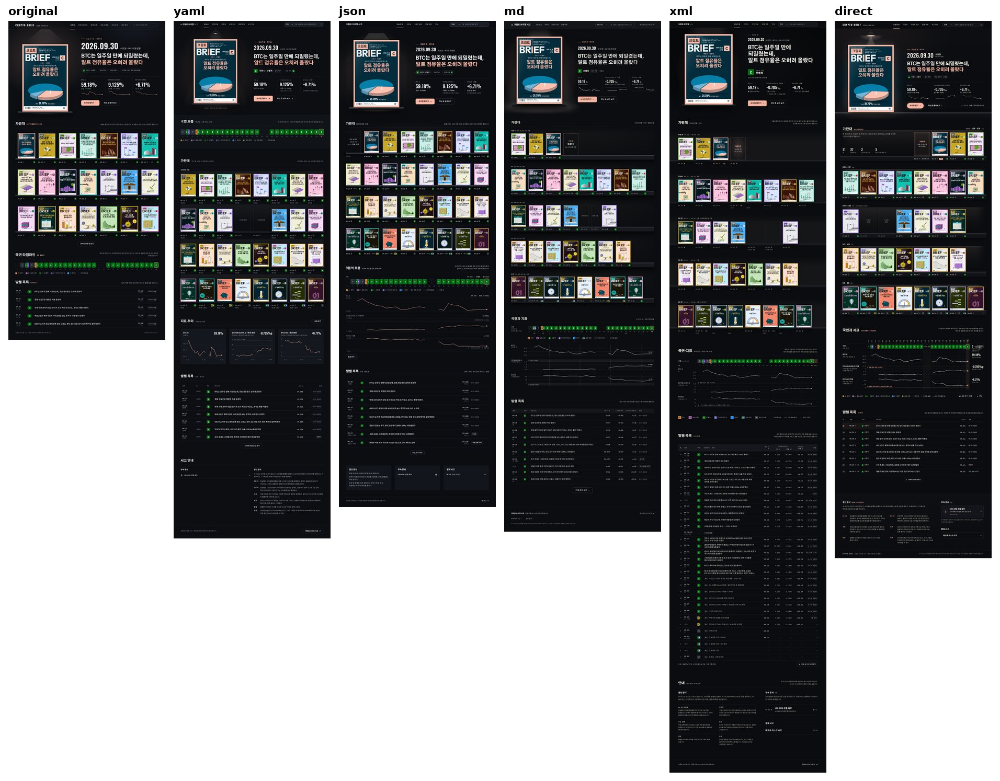
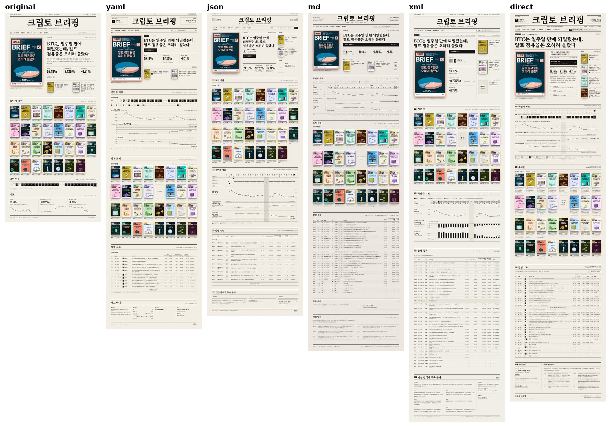
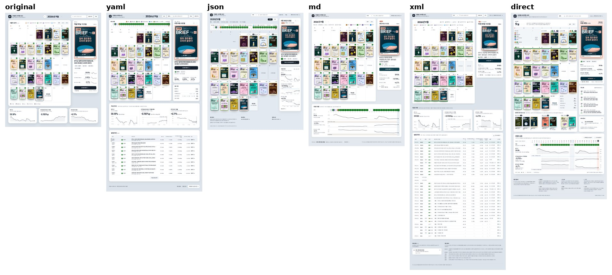

# 6. 2차 실험: 브리프+토큰, XML 태그, 명세 없이

앞선 대화에서 Claude는 YAML과 JSON 말고도 쓸 만한 형식으로 마크다운 브리프, XML 태그, 디자인 토큰을 소개했고, "짧은 마크다운 브리프와 토큰을 함께 쓰는 방식"을 추천하면서 그 방식이 형식만 바꾸는 것보다 결과가 더 안정적일 것이라고 말했습니다. 사용자는 그 방식과 XML 태그 방식으로 프롬프트를 쓰는 법을 물었고([08](08_프롬프트_작성_안내.md)), 이어서 "좋아 진행해보자"라고 답했습니다. 2차 실험은 이 추천이 맞는지 확인하려고 설계했습니다.

## 실험 설계

| 조건 | 명세 작성 | 구현 | 비고 |
| --- | --- | --- | --- |
| 브리프+토큰 (md) | 하위 에이전트 3개 | 하위 에이전트 3개 | 2차 실험에서 새로 만듦 |
| XML 태그 (xml) | 하위 에이전트 3개 | 하위 에이전트 3개 | 2차 실험에서 새로 만듦 |
| 명세 없이 (direct) | 없음 | 하위 에이전트 3개 | 브리프와 원래 시안을 보고 바로 만듦 |
| YAML, JSON | 1차 실험의 명세 | 1차 실험의 결과 | 평가에만 다시 넣음 |
| 원래 시안 | 없음 | 없음 | 평가에만 넣음 |

### 명세 작성

두 형식 모두 1차 실험과 같은 공통 브리프, 테마 브리프, 원래 시안 캡처를 읽고 썼습니다. 1차 실험의 폴더는 열지 못하게 했습니다.

- **브리프+토큰** (`specs/<테마>.md`): 세 부분으로 썼습니다.
  1. `# 디자인 브리프`: 목적, 분위기, 참고한 것, 고칠 점, 우선순위, 상태별 규칙, 피할 것, 맡기는 부분, 완료 기준. 50줄 안팎, 많아도 60줄입니다. 색상값과 픽셀 크기는 브리프에 쓰지 않고 토큰 이름으로 가리키게 했습니다.
  2. `# 토큰`: CSS `:root { }` 한 덩어리에 색, 글꼴, 글자 크기, 굵기, 줄 간격, 간격, 반경, 그림자, 레이아웃 폭, 표지 크기를 모두 담았습니다. 변수 이름은 색이 아니라 역할로 짓게 했습니다(`--text-2`, `--line-ref` 등).
  3. `# 요청`: 브리프는 판단의 기준이고 토큰은 그대로 쓸 값이며, 새 값이 꼭 필요하면 토큰에 더하고 마지막에 보고하라는 짧은 요청.
- **XML 태그** (`specs/<테마>.xml`): Anthropic이 공개한 프롬프트 작성 지침을 따라, 긴 자료를 위에 두고 지시를 맨 끝에 두었습니다.
  - 최상위 태그 순서: `<context>` → `<data>` → `<references>`(`<reference index="1" part="…">`를 부분마다 하나씩) → `<brief>` → `<tokens>` → `<instructions>`.
  - 지시에서는 태그 이름으로 내용을 가리키게 했습니다(예: "`<tokens>`에 있는 값만 쓴다").
  - 만들기 전에 10줄 이내의 계획을 `<plan>`에, 만든 뒤에 완료 기준 점검을 `<check>`에 쓰게 했습니다. 구현자가 쓴 계획과 점검은 `notes/<테마>_xml.md`에 있습니다.
  - 중요한 지시마다 이유를 적고, 하지 말 것보다 할 것을 쓰게 했습니다.

1차 실험과 달리, 2차 실험의 구현자는 "디자인 감각이 있는 개발자"로 설정했습니다. 토큰 값은 그대로 쓰되 브리프가 열어 둔 결정은 스스로 내리게 했습니다. 모바일 적응은 요구하지 않았습니다.

### 구현

- 명세가 있는 조건(md, xml)의 구현자는 자기 명세만 보았습니다. 원래 시안 캡처, 테마 브리프, 다른 명세는 열지 못하게 했습니다.
- 명세 없이 조건의 구현자는 공통 브리프, 테마 브리프, 원래 시안 캡처, `IMPLEMENT.md`를 보고 명세나 계획 문서 없이 바로 페이지를 만들었습니다.
- 작업자마다 임시 폴더(`experiment2/tmp/<이름>/`)를 따로 두어, 1차 실험처럼 서로의 파일을 보는 일이 없게 했습니다.

### 블라인드 평가

- 테마마다 평가자 2명(A, B)이 같은 테마의 여섯 페이지를 평가했습니다. 평가자는 모두 6명입니다.
- 평가자는 페이지가 어떻게 만들어졌는지 몰랐습니다. 페이지 이름은 평가자마다 무작위로 섞은 P1~P6이었고, 대응표는 [`cover_design/judge/judge_map.json`](../cover_design/judge/judge_map.json)에 있습니다.
- 평가자는 평가용 브리프(테마 콘셉트와 공통 브리프), 페이지마다 축소 전체 화면 1장과 1440×1400px 안팎의 조각 이미지를 보았습니다.
- 채점 항목(1~10점): 콘셉트 구현, 첫 화면과 위계, 표지 표현, 다섯 가지 일 지원, 가독성, 완성도. 여기에 종합 점수(평균이 아닌 종합 판단)와 동점 없는 순위, 페이지마다 강점 한 줄과 문제 한 줄을 적게 했습니다.

## 결과

### 조건별 평균

| 조건 | 콘셉트 | 첫 화면과 위계 | 표지 | 다섯 가지 일 | 가독성 | 완성도 | 종합 | 평균 순위 |
| --- | --- | --- | --- | --- | --- | --- | --- | --- |
| 명세 없이 | 9.0 | 7.5 | 8.5 | 9.0 | 7.7 | 7.8 | 8.3 | 1.83 |
| YAML | 8.0 | 8.5 | 7.7 | 8.3 | 8.3 | 8.3 | 8.0 | 2.33 |
| 브리프+토큰 | 7.3 | 8.3 | 7.8 | 7.8 | 7.5 | 7.5 | 7.3 | 3.50 |
| JSON | 8.2 | 8.3 | 6.7 | 8.2 | 7.8 | 7.8 | 7.2 | 3.67 |
| XML 태그 | 7.2 | 7.5 | 7.8 | 8.5 | 7.5 | 7.2 | 7.0 | 3.67 |
| 원래 시안 | 6.7 | 5.7 | 4.3 | 4.2 | 6.8 | 4.0 | 4.0 | 6.00 |

평가자 6명의 평균입니다. 원자료는 [`cover_design/experiment2/blind_scores.csv`](../cover_design/experiment2/blind_scores.csv)에 있습니다.

### 테마별 순위(평가자 A · 평가자 B)

| 조건 | 밤의 가판대 | 편집국 1면 | 달력 벽 |
| --- | --- | --- | --- |
| 명세 없이 | 1 · 1 | 1 · 4 | 3 · 1 |
| YAML | 2 · 3 | 4 · 2 | 1 · 2 |
| 브리프+토큰 | 4 · 2 | 2 · 3 | 5 · 5 |
| JSON | 3 · 4 | 5 · 5 | 2 · 3 |
| XML 태그 | 5 · 5 | 3 · 1 | 4 · 4 |
| 원래 시안 | 6 · 6 | 6 · 6 | 6 · 6 |

### 테마별 메모

캔버스에 남긴 메모를 옮깁니다.

**밤의 가판대**

- 명세 없이: 펜던트 전등 아래 오늘 호를 세우고, 가판대에는 한 주를 한 줄로 꽂았습니다. 선반 앞면에 날짜와 국면을 가격표처럼 붙이고, 이번 주 선반 끝에 '다음 호' 자리를 두었습니다. 국면 띠와 지표 차트 셋은 같은 날짜 축으로 묶었습니다. 두 평가자 모두 1위로 꼽았지만, 영문 꼬리표(ALL ISSUES, INDEX)가 남은 점은 지적을 받았습니다.
- 브리프+토큰: 가판대를 주 단위 선반 다섯 줄로 바꾸고, 브리핑 없는 날은 좁은 빈칸으로, 다음 호는 점선 칸으로 구분했습니다. 국면과 지표는 한 구역에 묶었습니다. 발행 목록에 59.3743처럼 자릿수가 다른 값이 그대로 나온 점과 조명이 옅은 점이 감점 요인이었습니다.
- XML 태그: 같은 주 단위 선반과 국면·지표 구역을 두고, 발행 목록 31호를 처음부터 모두 펼쳤습니다. 헤드라인이 세 줄로 끊기고 조명이 거의 보이지 않으며, 페이지가 6,905px로 가장 길어진 점이 지적되었습니다.

**편집국 1면**

- 명세 없이: 제호 양옆 귀퉁이에 오늘 국면과 다음 호를 두고, 1면을 표지·기사·지난 호의 3단으로 짰습니다. 2면에는 국면과 지표, 3면에는 표지 31장을 모은 축쇄판, 4면에는 발행 목록을 두었습니다. 평가자 두 명이 실행 시각(06:11~06:40)을 지어낸 값으로 보았지만, 이 값은 실제 데이터(`window` 필드)에 있습니다.
- 브리프+토큰: 헤더를 240px 안으로 줄여 첫 화면에 표지, 헤드라인, '브리핑 전문 읽기'를 모두 넣었습니다. 국면은 색 대신 먹 무늬로 구분하고, 같은 날 여러 호는 괄호선으로 묶었습니다. 지표 차트가 납작해서 읽기 어렵다는 지적이 있었습니다.
- XML 태그: 면 번호와 굵고 가는 괘선으로 신문 문법을 따르고, 국면을 빗금·점·줄 무늬로 옮겼습니다. 1면 오른쪽 서가에는 '제32호 발행 예정' 자리를 두었습니다. 첫 화면에서 표지가 절반만 보인다는 지적이 있었습니다.
- 세 테마 가운데 두 평가자의 순위가 가장 많이 엇갈린 테마입니다.

**달력 벽**

- 명세 없이: 날짜 밑에 국면 색 띠를 잇고, 달력 앞뒤 빈칸에 범례와 9월 기록을 넣었습니다. 여러 번 낸 날의 표지는 달력 아래 한 줄에 모두 펼쳤고, 국면과 지표는 '9월의 흐름'으로 묶었습니다. 오늘 호 헤드라인을 글로 싣지 않았고 '브리핑 열기' 버튼이 첫 화면 밖에 있다는 지적이 있었습니다.
- 브리프+토큰: 둥근 상자 대신 얇은 괘선 격자에 같은 크기의 표지를 넣고, 지표 카드 셋을 '9월의 흐름' 한 장으로 합쳤습니다. 여러 번 낸 날이 작은 '3회' 글자로만 보이고, 발행 목록이 첫 상태에 없다는 지적이 있었습니다.
- XML 태그: 칸 아래에 국면 색 선반을 깔아 한 주의 국면이 띠처럼 이어지게 했고, 발행 목록 31호를 모두 펼쳤습니다. 전체 표 때문에 페이지가 3,862px로 길어진 점이 지적되었습니다.

## 해석

- **명세 없이 바로 만든 페이지가 평균 1위였습니다.** 콘셉트와 다섯 가지 일 지원에서 가장 높은 점수를 받았습니다.
- **명세 형식 사이에는 일관된 승자가 없었습니다.** YAML이 전체 평균 2위였지만, 테마별 평균 순위로 보면 밤의 가판대에서는 명세 없이(1.0), 편집국 1면에서는 XML 태그(2.0), 달력 벽에서는 YAML(1.5)이 가장 앞섰습니다. 브리프+토큰은 편집국 1면에서 2.5였지만 달력 벽에서는 두 평가자 모두 5위를 주었습니다.
- **Claude가 앞서 추천한 브리프+토큰 방식이 더 안정적이라는 예상은 확인되지 않았습니다.** 이 점을 사용자에게 그대로 보고했습니다.
- **원래 시안은 모든 평가자에게서 6위였습니다.** 어떤 방식이든 한 번 다시 설계하면 원래 시안보다 나아졌다는 뜻입니다.
- **가능한 이유**: 명세를 거쳐 다른 사람에게 넘기는 과정에서 원래 시안을 직접 본 사람의 감각이 일부 빠지고, 체크리스트 같은 명세는 빠뜨림을 줄여도 화면의 완성도까지 보장하지는 못합니다.
- **한계**:
  - 조건마다 명세와 구현이 한 번씩이어서, 형식의 효과와 명세 작성자 개인의 결정을 가를 수 없습니다.
  - 1차(YAML, JSON)와 2차(브리프+토큰, XML 태그)는 명세 작성 지시가 달랐습니다. 1차는 모든 결정을 명세에 적게 했고, 2차는 브리프를 짧게 쓰고 구현자에게 판단을 맡겼습니다.
  - 평가자도 실수를 했습니다. 편집국 1면의 실행 시각처럼 실제 데이터를 지어낸 값으로 본 경우가 있었습니다.

## 그 뒤의 결정

사용자는 평균 1위인 '명세 없이' 대신 YAML 결과를 골랐습니다. "yaml이 가장 나은데. 지금 시안에 나온 yaml의 컬럼 구성, 배치 딱 이대로 반영하자."라는 요청에 따라, 밤의 가판대 YAML 결과를 실제 서고에 옮겼습니다([07](07_서고_적용_이력.md)).

## 파일

| 파일 | 내용 |
| --- | --- |
| `cover_design/experiment2/brief_*.md`, `IMPLEMENT.md` | 명세 작성자와 구현자에게 준 브리프와 안내(1차와 같은 내용에 경로와 지시 문구만 바꿈) |
| `cover_design/experiment2/specs/*.md` | 브리프+토큰 명세 3개(209~227줄) |
| `cover_design/experiment2/specs/*.xml` | XML 태그 명세 3개(356~377줄) |
| `cover_design/experiment2/<테마>_{md,xml,direct}.src.html`, `.html` | 구현 페이지 9개 |
| `cover_design/experiment2/notes/*_xml.md` | XML 태그 조건의 구현자가 쓴 `<plan>`과 `<check>` |
| `cover_design/experiment2/renders/*.jpg` | 구현 페이지 전체 화면(1배율) |
| `cover_design/experiment2/sheets/*.jpg` | 테마별 여섯 페이지를 나란히 놓은 비교 이미지 |
| `cover_design/experiment2/boards/res_*.jpg`, `blobs.json`, `boards2.py` | 캔버스에 올린 결과 화면(2배율), 캔버스 이미지 주소, 보드 생성 스크립트 |
| `cover_design/experiment2/blind_scores.csv` | 블라인드 평가 원자료(36행) |
| `cover_design/judge/<테마>_<A,B>/brief.md`, `scores.json` | 평가자에게 준 평가용 브리프와 평가자가 쓴 점수 |
| `cover_design/judge/judge_map.json`, `judge_unblinded.json` | P1~P6과 조건의 대응표, 조건 이름을 붙인 점수 |
| `cover_design/judge/scratch/` | 평가 과정에서 작업 공간에 남은 보조 스크립트 |
| `agents/17`~`37` | 명세 작성자, 구현자, 평가자에게 준 지시문과 최종 보고 |
