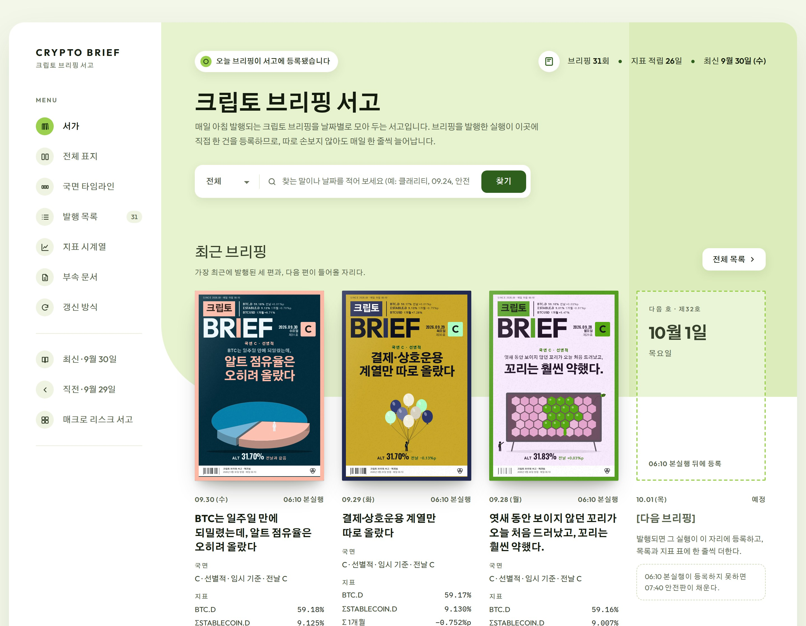
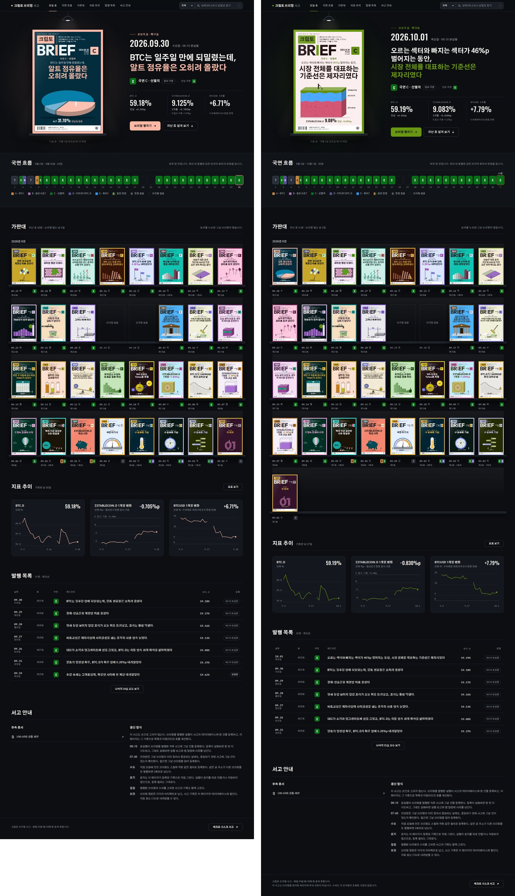

# 7. 서고 적용 이력

'크립토 브리핑 서고'(https://claude.ai/artifact/QnnPspYTfZKGGNSUpZsVNr)는 Claude 아티팩트로 게시된 웹 페이지입니다. 브리핑 기록은 페이지 안에 적혀 있지 않고, 아티팩트 데이터베이스의 `briefs`(브리핑)와 `related`(부속 문서) 컬렉션에 쌓입니다. 매일 06:10 본실행과 07:40 안전판이 그날 브리핑을 이 데이터베이스에 등록하면, 페이지가 그 기록으로 표지, 목록, 타임라인, 표를 계산합니다. 이 작업에서는 페이지를 두 번 바꿨습니다.

| 판 | 게시 시각(한국 시간) | 내용 | 파일 |
| --- | --- | --- | --- |
| 5번째 판 | 9월 30일 17:29 | 이 작업 전의 서고. 브리핑 한 편을 책 한 권으로 보고 책 표지를 그렸습니다. | `cover_design/page/src.html` |
| 6번째 판 | 9월 30일 23:00 | 표지를 잡지형 표지 모듈(시안 2)로 바꿨습니다. 페이지 구조는 그대로입니다. | `cover_design/page/final.html` |
| 7번째 판 | 10월 1일 12:29 | 페이지 전체를 밤의 가판대 테마(1차 실험의 YAML 결과)로 바꿨습니다. | `cover_design/library_night/final.html` |

`page/src.html`과 `page/final.html`은 각각 게시된 5번째 판, 6번째 판과 바이트 단위까지 같습니다. 게시할 때 런타임 기능 선언(데이터베이스 읽기는 보는 사람 모두, 쓰기는 소유자만, 그리고 내려받기)은 바꾸지 않았습니다.

## 6번째 판: 잡지형 표지 적용

`cover_design/build_page.py`가 5번째 판 원본(`page/src.html`)을 다음과 같이 바꿔 `page/final.html`을 만들었습니다.

1. 책 표지 CSS와 JS 블록을 잡지 표지 모듈(`mz.css`, `mz.js`)로 바꿨습니다.
2. 표지가 쓰는 글꼴 굵기를 더하고, 책 표지만 쓰던 글꼴(Do Hyeon, Noto Serif KR, Bodoni Moda, Cormorant Garamond)을 뺐습니다.
3. 다음 호 자리 표시를 페이지의 산세리프 제목 글꼴과 연두색 점선 테두리로 바꿨습니다.
4. '권' 단위 문구를 '호'로 바꾸고, 표지 설명 문단을 잡지형 표지 규칙에 맞게 새로 썼습니다.
5. 표지가 페이지에 들어간 뒤, 달을 펼친 뒤, 검색한 뒤, 글꼴을 불러온 뒤에 `BK.fit()`이 표제 크기를 맞추도록 연결했습니다.

같은 스크립트가 만든 `page/preview.html`은 내려받은 글꼴과 `data.js`를 쓰고 시계를 9월 30일 21:15로 고정한 로컬 미리보기입니다.

## 7번째 판: 밤의 가판대 적용

### 요청

> yaml이 가장 나은데. 지금 시안에 나온 yaml의 컬럼 구성, 배치 딱 이대로 반영하자.

### 옮긴 것

1차 실험의 밤의 가판대 YAML 결과(`cover_design/experiment/night_yaml.src.html`)와 그 명세(`experiment/specs/night.yaml`)를 기준으로 삼았습니다.

- 구역 순서: 상단 막대 → 오늘의 호(히어로) → 국면 흐름 → 가판대 → 지표 추이 → 발행 목록 → 서고 안내 → 바닥글.
- 열 구성과 크기: 히어로의 표지 무대와 글 열, 가판대 한 줄 8칸(표지 143px), 지표 카드 3장, 발행 목록의 열.
- 토큰: 색(`--bg #0C0E12` 등), 글자 단계(`--ty-*`), 국면 색, 간격을 YAML 시안의 `:root` 그대로 옮겼습니다.
- 강조색: 최신 호 표지의 테두리 색(`pal(L).fr`)을 쓰고, `--s2`(#1A1F26)와의 명암비가 4.5 이상이 될 때까지 밝힙니다. 그래서 9월 30일에는 복숭아색, 10월 1일에는 연두색이 됩니다.

### 다시 연결한 실제 기능

실험 페이지는 고정된 데이터 사본으로 그린 그림이었으므로, 실제 서고에 있던 기능을 다시 연결했습니다.

- **데이터**: `claude.use('db')`로 `briefs`와 `related` 컬렉션을 구독하고(`onSnapshot`), 기록이 바뀌면 다시 그립니다. 값 정리(`normalize`)는 6번째 판의 것을 그대로 쓰고, 주소는 안전한 주소만 링크로 만듭니다.
- **CSV 내려받기**: `claude.use('downloads')`로 지표 표를 CSV로 저장합니다.
- **부속 문서**: 데이터베이스의 `related` 기록으로 목록을 그립니다.
- **알림 문구**: 바닥글에 "이 서고는 브리핑을 정리한 색인이며 투자 자문이 아닙니다." 문장을 남겼습니다.
- **실제 링크**: 브리핑 아티팩트 주소와 형제 서고(매크로 리스크 서고) 주소를 씁니다.
- **다음 호 문구**: 오늘 호가 이미 있으면 다음 날 '06:10 예정'을 보여 줍니다. 오늘 호가 아직 없으면 한국 시간에 따라 '06:10 예정'(06:10 전), '등록을 기다리는 중'(06:10~08:00), '아직 등록되지 않음'(08:00 이후)을 보여 줍니다.
- **가판대 접기**: 실제 오늘 날짜(한국 시간)를 기준으로 이번 달과 지난달은 펼쳐 두고, 그보다 오래된 달은 접은 채 '펼치기' 버튼을 둡니다.
- **검색과 펼치기**: 범위 선택과 입력, 결과 판, 발행 목록 펼치기, 표 보기, 국면 칸 툴팁을 동작하게 했습니다.

### 화면 폭 대응

YAML 시안은 폭 1440px 한 장으로 만든 그림이었으므로, 실제 페이지에서는 다음 규칙을 더했습니다.

| 화면 폭 | 처리 |
| --- | --- |
| 1440px 이상 | 시안과 같은 고정 배치(내용 폭 1312px) |
| 1280~1439px | 같은 배치를 CSS `zoom`으로 비율대로 줄입니다(`--z` = 폭 ÷ 1440). |
| 1280px 미만 | YAML 명세의 `mobile_390` 규칙을 따른 좁은 배치: 히어로를 세로로 쌓고, 국면 띠는 34px 칸으로 가로 스크롤하며, 가판대는 폭에 맞춰 한 줄 칸 수를 바꾸고, 카드는 세로로 쌓고, 목록은 두 줄 행으로 바꾸고, 메뉴와 검색은 펼침 판으로 엽니다. |
| 700px 미만 | 좌우 여백을 16px로 줄입니다. |

### 확인

`library_night/build.py`가 만든 로컬 미리보기(`preview.html`, 데이터베이스와 내려받기를 흉내 낸 가짜 `window.claude`, 10월 1일 12:30으로 고정한 시계)를 `library_night/shot.py`로 1440, 1300, 820, 390px 폭에서 캡처해 가로 넘침, 표지 헤드라인 넘침, 오류를 확인했습니다. 390px에서 가판대 빛 효과(`.slot .sglow`, 폭 160px) 때문에 생긴 9px 가로 넘침을 찾아 좁은 배치에서 폭을 칸에 맞추도록 고쳤고, 고친 뒤 화면 폭이 390px로 맞는 것을 확인했습니다.

| 캡처 | 파일 |
| --- | --- |
| 1440px 첫 화면 | `library_night/screenshots/lib_1440_top.jpg` |
| 1440px 전체 | `lib_1440.jpg`, 고친 뒤 `libfix_1440.jpg` |
| 1300px 전체(비율 축소) | `lib_1300.jpg` |
| 820px 전체(좁은 배치) | `lib_820.jpg`, 구역별로 나눈 `lib_820_cols.jpg` |
| 390px 전체(좁은 배치) | `lib_390.jpg`(고치기 전, 폭 399px), 고친 뒤 `libfix_390.jpg`, 구역별로 나눈 `lib_390_cols.jpg` |
| YAML 시안과 비교 | `cmp_lib.jpg` |

7번째 판은 10월 1일 12시 29분에 같은 주소로 게시되었습니다. 링크를 받은 사람도 바뀐 화면을 곧바로 보게 됩니다.

## 파일

| 파일 | 내용 |
| --- | --- |
| `cover_design/library_night/src.html` | 7번째 판 원본. `/*<<MZCSS>>*/`, `/*<<MZJS>>*/` 자리에 표지 모듈이 들어갑니다. |
| `cover_design/library_night/build.py` | `final.html`(게시본)과 `preview.html`(로컬 미리보기)을 만듭니다. |
| `cover_design/library_night/final.html` | 게시한 7번째 판 |
| `cover_design/library_night/preview.html` | 로컬 미리보기 |
| `cover_design/library_night/shot.py` | 여러 폭으로 캡처하고 넘침과 오류를 출력합니다(`python3 shot.py <접두어> 1440 820 390`). |
| `cover_design/library_night/db_snapshot.json` | 게시 직전에 읽은 데이터베이스 사본(브리핑 32건, 부속 문서 1건) |
| `cover_design/library_night/db/` | 같은 사본을 기록 하나에 파일 하나로 나눈 것 |
| `cover_design/library_night/screenshots/` | 확인용 캡처 |
| `cover_design/page/src.html`, `final.html`, `preview.html` | 5번째 판, 6번째 판, 6번째 판 미리보기 |
| `cover_design/build_page.py` | 6번째 판 빌드 스크립트 |
